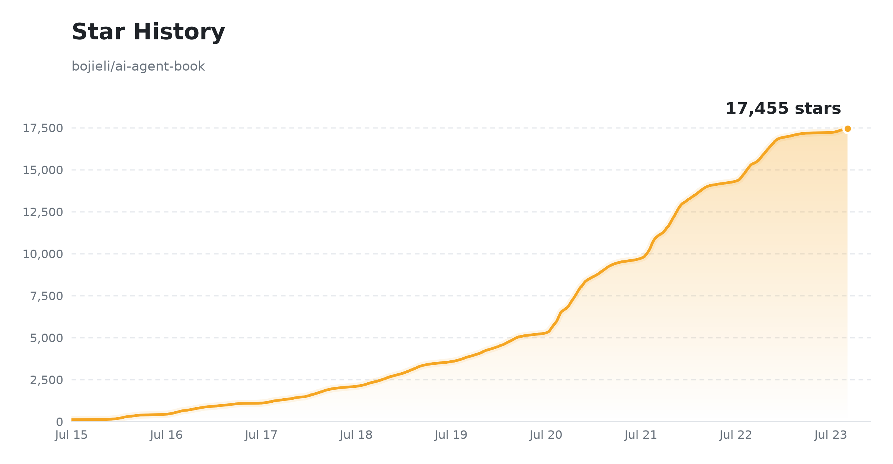

# Глубокое понимание AI Agent: принципы проектирования и инженерная практика

[](https://bojieli.github.io/ai-agent-book/) [](https://github.com/bojieli/ai-agent-book) [](../../LICENSE) [](#-электронная-книга) [](#-электронная-книга)

**[中文](../../README.md) · [正體中文](../zh-TW/README.md) · [English](../en/README.md) · Русский ← текущий · [Tiếng Việt](../vi/README.md) · [தமிழ்](../ta/README.md)**

> 🌐 **[Читать онлайн](https://bojieli.github.io/ai-agent-book/)** — Переключатель языков, сворачиваемое оглавление, полнотекстовый поиск и прямые ссылки на сопутствующие эксперименты. Сайт автоматически перестраивается при каждом пуше в main.

**Агент = LLM + Контекст + Инструменты** — книга строится вокруг этой базовой формулы и за 10 глав ведёт AI Agent от принципов к инженерной практике. Весь текст, иллюстрации и **92 сопутствующих эксперимента** открыты. Приглашаем прогнать эксперименты своими руками.

| 📚 **10 глав** текста, от основ к продакшену | 📂 **92** сопутствующих проектов (70+ автономных) | 🌐 **6 языков**: CN / zh-TW / EN / **RU** / TA / VI |
| :---: | :---: | :---: |

## 📖 Электронная книга

> 📥 **Скачать** (полный текст, бесплатно и открыто). Ссылки всегда указывают на свежую сборку ветки `main`; фиксированные издания — на странице [Releases](https://github.com/bojieli/ai-agent-book/releases):
> - **Китайский (оригинал)**: [PDF](https://github.com/bojieli/ai-agent-book/releases/download/latest/AI-Agents-in-Depth-zh-CN.pdf) · [EPUB](https://github.com/bojieli/ai-agent-book/releases/download/latest/AI-Agents-in-Depth-zh-CN.epub)
> - **Китайский традиционный (Тайвань)** (перевод сообщества, [@tigercosmos](https://github.com/tigercosmos)): [PDF](https://github.com/bojieli/ai-agent-book/releases/download/latest/AI-Agents-in-Depth-zh-TW.pdf) · [EPUB](https://github.com/bojieli/ai-agent-book/releases/download/latest/AI-Agents-in-Depth-zh-TW.epub)
> - **Английский** (перевод сообщества, [@nsdevaraj](https://github.com/nsdevaraj)): [PDF](https://github.com/bojieli/ai-agent-book/releases/download/latest/AI-Agents-in-Depth-en.pdf) · [EPUB](https://github.com/bojieli/ai-agent-book/releases/download/latest/AI-Agents-in-Depth-en.epub)
> - **Русский** (перевод сообщества, [@ui99ru](https://github.com/ui99ru)): [PDF](https://github.com/bojieli/ai-agent-book/releases/download/latest/AI-Agents-in-Depth-ru.pdf) · [EPUB](https://github.com/bojieli/ai-agent-book/releases/download/latest/AI-Agents-in-Depth-ru.epub)
> - **Тамильский** (перевод сообщества, [@nsdevaraj](https://github.com/nsdevaraj)): [PDF](https://github.com/bojieli/ai-agent-book/releases/download/latest/AI-Agents-in-Depth-ta.pdf) · [EPUB](https://github.com/bojieli/ai-agent-book/releases/download/latest/AI-Agents-in-Depth-ta.epub)
> - **Вьетнамский** (перевод сообщества, [@toanalien](https://github.com/toanalien)): [PDF](https://github.com/bojieli/ai-agent-book/releases/download/latest/AI-Agents-in-Depth-vi.pdf) · [EPUB](https://github.com/bojieli/ai-agent-book/releases/download/latest/AI-Agents-in-Depth-vi.epub)

Исходник китайского текста — в [`book/`](../../book/); версии на традиционном китайском (Тайвань)/английском/русском/тамильском/вьетнамском — вклад сообщества (могут отставать от китайского оригинала), расположены в [`book-zhtw/`](../../book-zhtw/), [`book-en/`](../../book-en/), [`book-ru/`](../../book-ru/), [`book-ta/`](../../book-ta/), [`book-vi/`](../../book-vi/) соответственно.

Общий сборщик собирает издания EPUB 3 для упрощённого китайского, традиционного китайского (Тайвань), английского, русского, тамильского и вьетнамского. См. [инструкцию по сборке EPUB](../../EPUB.md).

<details>
<summary><b>🔧 Собрать PDF самому?</b> (нужны pandoc / xelatex / ElegantBook)</summary>

- **Исходник текста**: `book-ru/introduction.md` (введение), `book-ru/chapter1.md` ~ `book-ru/chapter10.md` (главы 1–10), `book-ru/afterword.md` (послесловие)
- **Сборка**: установите pandoc, xelatex, класс документа ElegantBook и нужные шрифты, затем выполните

  ```bash
  cd book-ru && bash build_pdf.sh
  ```

  Иллюстрации лежат в `book-ru/images/`; детали типографики — в `book-ru/preamble.tex` и `book-ru/*.lua`.

</details>

## 📑 Обзор содержания (главы 1–10)

Книга строится вокруг базовой формулы **Агент = LLM + Контекст + Инструменты**, и десять глав раскрывают её постепенно:

| Гл | Тема | Кратко | Текст | Код |
| :--: | --- | --- | :--: | :--: |
| 1 | 🚀 **Основы агентов** | Парадигма «модель как агент» + **Агент = LLM + Контекст + Инструменты**; harness-инженерия — вот настоящее преимущество | [Читать](../../book-ru/chapter1.md) | [4](../../chapter1/README.ru.md) |
| 2 | 🎯 **Инженерия контекста** | Контекст ограничивает возможности агента: KV Cache, инженерия промптов, Agent Skills, сжатие контекста | [Читать](../../book-ru/chapter2.md) | [9](../../chapter2/README.ru.md) |
| 3 | 📚 **Память пользователя и базы знаний** | Кросс-сессионная память + внешние знания: пользовательская память, RAG, структурированные индексы, графы знаний | [Читать](../../book-ru/chapter3.md) | [13](../../chapter3/README.ru.md) |
| 4 | 🛠️ **Инструменты** | Инструменты — руки агента: протокол MCP, инструменты восприятия/исполнения/сотрудничества, событийные асинхронные агенты, активное обнаружение инструментов | [Читать](../../book-ru/chapter4.md) | [7](../../chapter4/README.ru.md) |
| 5 | 💻 **Кодинг-агент и генерация кода** | Код — «инструмент, создающий новые инструменты»; промышленный кодинг-агент целиком | [Читать](../../book-ru/chapter5.md) | [12](../../chapter5/README.ru.md) |
| 6 | 🎯 **Оценка агентов** | Превращаем качество в сравнимые сигналы: среды, метрики, статзначимость, выбор на основе оценки | [Читать](../../book-ru/chapter6.md) | [11](../../chapter6/README.ru.md) |
| 7 | 🧠 **Постобучение модели** | Три стадии предобучение/SFT/RL: когда выбирать SFT, а когда RL, внедрение вызова инструментов, эффективность выборки | [Читать](../../book-ru/chapter7.md) | [16](../../chapter7/README.ru.md) |
| 8 | 🔄 **Самоэволюция агента** | Рост без изменения весов: обучение на опыте, от пользователя инструментов к их создателю | [Читать](../../book-ru/chapter8.md) | [6](../../chapter8/README.ru.md) |
| 9 | 🎙️ **Мультимодальность и реальное время** | От текста к голосу, GUI, физическому миру: три голосовые парадигмы, Computer Use, робототехника | [Читать](../../book-ru/chapter9.md) | [7](../../chapter9/README.ru.md) |
| 10 | 🤝 **Многоагентное взаимодействие** | Коллективный интеллект > индивидуального: фреймворки сотрудничества, разделение/изоляция контекста, эмерджентное «общество агентов» | [Читать](../../book-ru/chapter10.md) | [7](../../chapter10/README.ru.md) |

> 💡 **Читать** = читать текст главы на GitHub (markdown); **N** = число сопутствующих проектов, кликните для кода. Типы проектов (✅ автономный / 📖 воспроизведение / 🚧 проектный) поясняются в README каждой главы.
>
> 📚 Как читать книгу эффективно? См. **[Советы по обучению](LEARNING.md)** (ключевые идеи, путь обучения, уровни сложности, советы по практике).

## 🔑 API-ключи

Для удобства обучения рекомендуется получить API-ключи на нескольких платформах. По выбору модели см. [этот гайд](https://01.me/2025/07/llm-api-setup/).

| Платформа | Ссылка | Примечания | Точки доступа |
| --- | --- | --- | --- |
| **Kimi** (Moonshot) | <https://platform.moonshot.cn/> | Серия Kimi, сильна в длинном контексте и возможностях агента | Материковый Китай |
| **Zhipu GLM** | <https://open.bigmodel.cn/> | GLM-4.6 и др., сильный китайский, выгодная цена | Материковый Китай |
| **Siliconflow** | <https://siliconflow.cn/> | Разные открытые модели (DeepSeek, Qwen и др.), быстрый доступ из материкового Китая | Материковый Китай |
| **DeepSeek** | <https://platform.deepseek.com/> | Официальный API DeepSeek | Весь мир + материковый Китай |
| **Krill AI** | [www.krill-ai.com](https://www.krill-ai.com/register?invite=Q8D3L35725) | Единый доступ к основным мировым и китайским моделям (OpenAI, Claude, Gemini, Grok, Kimi, GLM, DeepSeek, Qwen, Minimax) | Весь мир + материковый Китай |
| **OpenRouter** | <https://openrouter.ai/> | Единый доступ к основным мировым и китайским моделям (GPT, Claude, Gemini, Kimi, GLM, DeepSeek, Qwen и др.) | Весь мир |

## 💎 Спонсоры

Благодарим **Krill AI** за спонсорство проекта! Krill предоставляет официальный, стабильный и сверхбыстрый API-шлюз для GPT / Claude / Gemini и множества китайских моделей, с корпоративной настройкой, счетами для возмещения расходов, выделенной технической поддержкой 7×16 ч, а также эксклюзивным подключением по WebSocket для молниеносного времени до первого токена.

Krill предлагает читателям книги специальную скидку: зарегистрируйтесь по [этой ссылке](https://www.krill-ai.com/register?invite=Q8D3L35725) и укажите промокод «ai-agent-book» при пополнении счёта, чтобы получить скидку 23% на первую покупку пакета Codex!

## 📦 Приложение · Получение внешних репозиториев

19 внешних репозиториев для бенчмарков, обучающих фреймворков и робо-платформ из глав 6, 7, 9, 10 **не включены** (из-за размера и лицензий) и должны быть склонированы в соответствующие каталоги.

### Скрипт клонирования одной командой

<details>
<summary><b>🔧 Развернуть команды клонирования</b> (19 внешних репозиториев)</summary>

```bash
# Глава 6 · Бенчмарки оценки
git clone https://github.com/google-research/android_world.git         chapter6/android_world
git clone https://huggingface.co/datasets/gaia-benchmark/GAIA          chapter6/GAIA
git clone https://github.com/xlang-ai/OSWorld.git                      chapter6/OSWorld
git clone https://github.com/SWE-bench/SWE-bench.git                   chapter6/SWE-bench
git clone https://github.com/sierra-research/tau2-bench.git            chapter6/tau2-bench
git clone https://github.com/laude-institute/terminal-bench.git        chapter6/terminal-bench

# Глава 7 · Обучающие фреймворки (bojieli/* — адаптированные под книгу форки)
git clone https://github.com/bojieli/minimind.git                      chapter7/MiniMind-pretrain/minimind      # Эксп. 7-3: обучение LLM с нуля
git clone https://github.com/bojieli/minimind-v.git                    chapter7/MiniMind-pretrain/minimind-v    # Эксп. 7-4: обучение VLM с нуля (проекционный слой)
git clone https://github.com/bojieli/AdaptThink.git                    chapter7/AdaptThink-original
git clone https://github.com/bojieli/AWorld.git                        chapter7/AWorld
git clone https://github.com/bojieli/SFTvsRL.git                       chapter7/SFTvsRL
git clone https://github.com/bojieli/verl.git                          chapter7/verl
git clone https://github.com/thinking-machines-lab/tinker-cookbook.git chapter7/tinker-cookbook
git clone https://github.com/19PINE-AI/rlvp.git                        chapter7/RLVP/rlvp                       # Эксп. 7-14: код статьи RLVP
git clone https://github.com/PRIME-RL/SimpleVLA-RL.git                 chapter7/SimpleVLA-RL/SimpleVLA-RL       # Эксп. 7-13: RL «зрение-язык-действие»

# Глава 9 · Автоматизация браузера и примеры Claude
git clone https://github.com/browser-use/browser-use.git               chapter9/browser-use
git clone https://github.com/anthropics/claude-quickstarts.git         chapter9/claude-quickstarts

# Глава 10 · Архитектура двух агентов (теперь отдельный проект TalkAct) + Stanford AI Town
git clone https://github.com/19PINE-AI/TalkAct.git                     chapter10/use-computer-while-calling
git clone https://github.com/joonspk-research/generative_agents.git    chapter10/generative_agents             # Эксп. 10-7: Stanford AI Town
```

> Если README проекта указывает конкретный коммит, сделайте `git checkout` на эту версию для воспроизводимости. `use-computer-while-calling` из главы 10 вырос в самостоятельно поддерживаемый [19PINE-AI/TalkAct](https://github.com/19PINE-AI/TalkAct); этот каталог в репозиторий не входит — получите его командой клонирования выше.

</details>

### Прочие пути воспроизведения

У экспериментов ниже нет отдельной команды клонирования, но есть конкретные способы воспроизведения:

| Эксперимент | Тип | Примечания |
| --- | :--: | --- |
| 6-2 / 6-3 / 6-4 / 6-9 | 📝 Задание для читателя | Человеческий бенчмарк, оценка памяти, JSON Cards vs RAG, выбор памяти — адаптируйте `user-memory` / `user-memory-evaluation` / `contextual-retrieval` из главы 3 |
| 5-12 | 📝 Задание для читателя | Агент, создающий агентов — начните с `chapter5/coding-agent` |
| 7-8 | 📝 Задание для читателя | Дистилляция промптов — см. `chapter8/prompt-distillation` (переиспользование между главами) |
| 7-9 | 📝 Задание для читателя | Дистилляция CoT `[Расширение]` — сопутствующая реализация см. в `chapter7/cot-distillation` (включая генерацию SFT-данных и верификатор на правилах) |
| 6-11 | 🤖 Оценка в симуляции | OpenVLA + RoboTwin2 — см. README `chapter7/SimpleVLA-RL` по зависимостям обучения/среды VLA |
| 9-8 / 9-9 | 🔧 Реальное железо | Телеуправление XLeRobot и управление LLM-агентом — нужна рука SO-100, [Teleop](https://xlerobot.readthedocs.io/en/latest/software/getting_started/XLeRobot_teleop.html) · [LLM Agent](https://xlerobot.readthedocs.io/en/latest/software/getting_started/LLM_agent.html) |
| 9-10 | 🔧 Реальное железо | RGB zero-shot Sim2Real-захват — [`StoneT2000/lerobot-sim2real`](https://github.com/StoneT2000/lerobot-sim2real) (симуляция на чистом GPU; для развёртывания нужен SO-100) |

## 🤝 Как внести вклад

Книга и сопровождающий код полностью открыты. Pull Request'ы очень приветствуются:

| Тип | Примечания |
| --- | --- |
| 📝 **Содержание книги** | Опечатки, дополнения, более ясные формулировки или новые разработки (текст в `book/chapter*.md`) |
| 🐛 **Улучшения кода и багфиксы** | Сделать сопутствующие проекты надёжнее, удобнее и ближе к продакшену |
| 🧪 **Новые практические проекты** | Добавить/заменить лучшими реализациями эксперименты или предложить новые примеры |
| 🎨 **Дизайн иллюстраций** | Сделать схемы `book/images/` яснее и аккуратнее (генерируются `book/gen_*_figs.py`) |
| 🌐 **Новые переводы** | Переводы на другие языки приветствуются; за образец возьмите традиционный китайский/Тайвань (`book-zhtw/`), английский (`book-en/`), русский (`book-ru/`), тамильский (`book-ta/`), вьетнамский (`book-vi/`) |

Перед отправкой прогоните соответствующие эксперименты для подтверждения воспроизводимости; идеи можно предварительно обсудить в issue.

## 📄 Лицензия

Проект распространяется под [Apache License 2.0](../../LICENSE). Подробности — в файле [`LICENSE`](../../LICENSE). Некоторые подпроекты могут включать собственную лицензию; уточняйте в подпроекте.

## ⭐ История звёзд

<a href="https://star-history.com/#bojieli/ai-agent-book&Date">
  <picture>
    <source media="(prefers-color-scheme: dark)" srcset="../../assets/star-history-dark.png" />
    <source media="(prefers-color-scheme: light)" srcset="../../assets/star-history-light.png" />
    
  </picture>
</a>

<sub>Сгенерировано [`scripts/gen_star_history.py`](../../scripts/gen_star_history.py), ежедневно обновляется [GitHub Actions](../../.github/workflows/star-history.yml) · Кликните по картинке для актуальных данных</sub>
